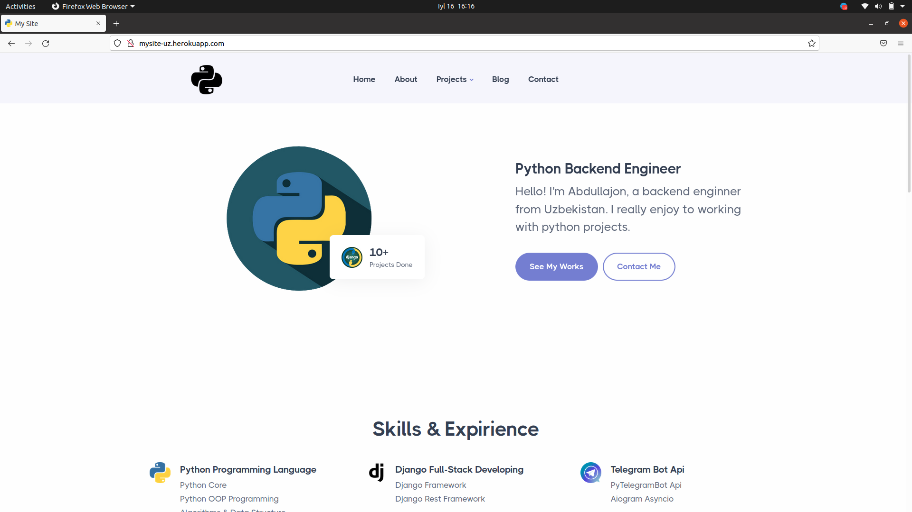
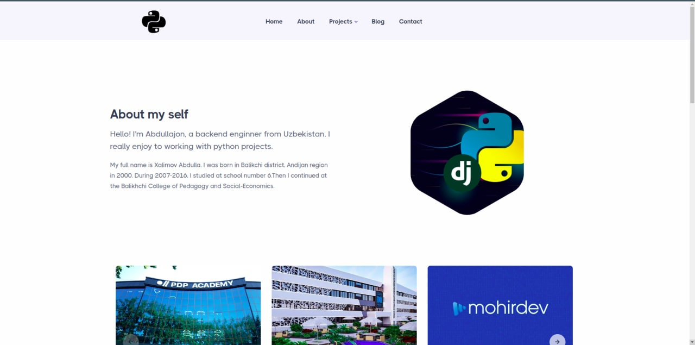
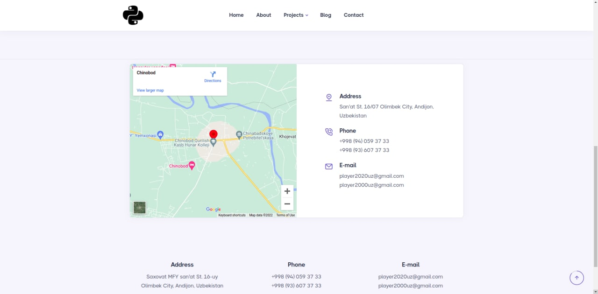

# About My Self | Simple Django website 
Sourcode and Resources for My Site  
Live website - https://mysite-uz.herokuapp.com/ 
 

# Installation
* 1 - clone repo https://github.com/django-dev-uz/My-site.git
* 2 - create a virtual environment and activate
*  - pip install virtualenv
*  - virtualenv env
*  - env\Scripts\activate
* 3 - cd into project "mysite"
* 4 - set your .env file with using .env_example
* 5 - pip install -r requirements.txt
* 6 - python manage.py loaddata fixture/products.json
* 7 - python manage.py runserver

# Features
* This site is about me and my abilities.

# Completed with
* Django 
* Database Design and Models with Postgresql
* Deployment to heroku
